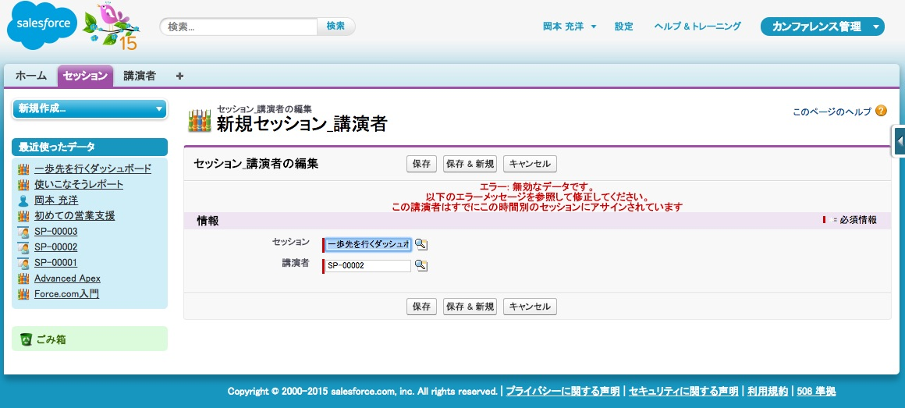

このモジュールでは、講演者をセッションに割り当てた時点でその講演者に確認メールを送信するトリガを作成します。また、講演者のダブルブッキングを防ぐためのトリガも作成します。

## ステップ 1: 確認メールを送信するトリガを作成する

このステップでは、講演者をセッションに割り当てた時点でその講演者に確認メールを送信するトリガを作成します。

1. 開発者コンソールで、**File** > **New** > **Apex Trigger** の順にクリックします

1. トリガ名に **SendConfirmationEmail** と入力し、sObjectには **Session_Speaker__c** を指定し、**Submit** をクリックします。

1. 次のようにトリガを実装します:

    ```
    trigger SendConfirmationEmail on Session_Speaker__c (after insert) {

        for(Session_Speaker__c newItem : trigger.new) {

            // セッション名、日時、スピーカー名、メールアドレスを取得
            Session_Speaker__c sessionSpeaker =
                [SELECT Session__r.Name,
                        Session__r.Session_Date__c,
                        Speaker__r.First_Name__c,
                        Speaker__r.Last_Name__c,
                     Speaker__r.Email__c
                 FROM Session_Speaker__c WHERE Id=:newItem.Id];

            // 講演者のEメールアドレスに入力がああれば、確認メールを送信する
            if (sessionSpeaker.Speaker__r.Email__c != null) {
                String address = sessionSpeaker.Speaker__r.Email__c;
                String subject = '講演者確認';
                String message = sessionSpeaker.Speaker__r.Last_Name__c + ' 様' +
                    ',\nあなたのセッション "' + sessionSpeaker.Session__r.Name + '" は ' +
                    sessionSpeaker.Session__r.Session_Date__c + ' に予定されています。\n\n' +
                    'カンファレンスでの公演ありがとうございます!!';
                EmailManager.sendMail(address, subject, message);
            }
        }

    }
    ```

    > 実際に利用するアプリケーションでは、メールメッセージのハードコードはお勧めしません。代わりに[メールテンプレート](https://help.salesforce.com/HTViewHelpDoc?id=admin_emailtemplates.htm)を使うことを検討してください。

1. ファイルを保存します。トリガは保存と同時に有効になります。

1. トリガをテストします
  - スピーカーのレコードを新規に作成し、そこに自分のメールアドレスを設定します
  - そのスピーカーをセッションに割り当てて、スピーカーへの確認メールが届くことを確認します。

  > 講演者をセッションに割り当てた時点（つまり、Session&#95;Speaker__cのレコードを作成したとき）で確認メールを送信する場合、[ワークフロールール](https://developer.salesforce.com/page/Workflow_Rules)を定義すれば、コードを記述せずに実行することもできます。しかし、このワークショップで扱うプログラム的な手法では、ワークフローとは異なり、さまざまな要件に対応することが可能です。たとえば、レコードの作成や更新とは関係なく、確認メールを「オンデマンド」で送信することなどができます。


## ステップ 2: ダブルブッキングを回避するトリガを作成する

1. 開発者コンソールで、**File** > **New** > **Apex Trigger** の順にクリックします

1. トリガ名に **RejectDoubleBooking** と入力し、sObjectには **Session_Speaker__c** を指定し、 **Submit** をクリックします

1. 次のようにトリガを実装します:

    ```
    trigger RejectDoubleBooking on Session_Speaker__c (before insert, before update) {

        for(Session_Speaker__c sessionSpeaker : trigger.new) {

            // セッション情報（日時など）を取得
            Session__c session = [SELECT Id, Session_Date__c FROM Session__c
                                    WHERE Id=:sessionSpeaker.Session__c];

            // ダブルブッキングに関する情報（同じ時間帯の別のセッションに割り当てられていないか）を取得
            List<Session_Speaker__c> conflicts =
                [SELECT Id FROM Session_Speaker__c
                    WHERE Speaker__c = :sessionSpeaker.Speaker__c
                    AND Session__r.Session_Date__c = :session.Session_Date__c];

            // ダブルブッキングが起きている場合、エラーを作成（データベース処理を却下）
            if(!conflicts.isEmpty()){
                sessionSpeaker.addError('The speaker is already booked at that time');
            }

        }

    }
    ```

1. ファイルを保存します

1. 次の手順を実行し、トリガをテストします:
  - スピーカーの予定が空いている時間帯のセッションに講演者を割り当て、問題ないことを確認します
  - すでにスピーカーを割り当てているセッションと同じ時間帯に実施される別のセッションにスピーカーを割り当て、エラーメッセージが表示されることを確認します

  

  > RejectDoubleBookingは、スピーカーのダブルブッキングを完全には回避できません。たとえば、ユーザがセッションの日時を後から変更した場合、該当するセッションに割り当てられているスピーカーのダブルブッキングが発生する可能性があります。こうした状況は、別のトリガを作成することによって回避します。


<div class="row" style="margin-top:40px;">
<div class="col-sm-12">
<a href="Accessing-Data-using-SOQL-and-DML.html" class="btn btn-default"><i class="glyphicon glyphicon-chevron-left"></i> 戻る</a>
<a href="Creating-a-Visualforce-Page.html" class="btn btn-default pull-right">次へ <i class="glyphicon glyphicon-chevron-right"></i></a>
</div>
</div>
