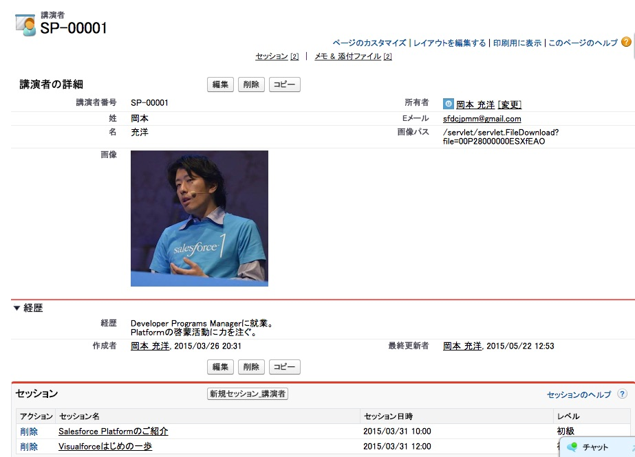

このモジュールでは、モジュール 7 で作成した Visualforce ページの機能を強化します。コントローラ拡張機能を作成して、スピーカーの写真をアップロードできるようにします



## ステップ 1: コントローラ拡張機能を作成する

In this step, you experiment with the mechanics of a controller extension. You create a simple controller extension that exposes an **increment()** method and a **counter** property. When you click the Increment button in the SpeakerForm page, the extension's increment() method increments the counter property whose new value is automatically displayed in the page. In the next step, you make SpeakerControllerExtension a lot more useful by adding code to support the upload of speaker pictures.

1. 開発者コンソールで、 **File** > **New** > **ApexClass** の順にクリックし、クラス名に **SpeakerControllerExtension** と入力し、 **OK** をクリックします

1. 次のようにクラスを実装します:

    ```
    public class SpeakerControllerExtension {

        public Integer counter {get; set;}

        private final Speaker__c speaker;
        private ApexPages.StandardController stdController;

        public SpeakerControllerExtension(ApexPages.StandardController stdController) {
            this.speaker = (Speaker__c)stdController.getRecord();
            this.stdController = stdController;
            counter = 0;
        }

        public void increment() {
            counter++;
        }

    }
    ```
1. ファイルを保存します

1. 開発者コンソールでSpeakerFormのページを開き、ページの定義にコントローラ拡張機能を追加します:

    ```
    <apex:page standardController="Speaker__c" extensions="SpeakerControllerExtension">
    ```

1. Add an Increment button (right after the Save button):

    ```
    <apex:commandButton action="{!increment}" value="Increment"/>
    ```

1. Display the counter (right after &lt;/apex:pageBlock>):

    ```
    {!counter}
    ```

1. ファイルを保存します

1. アプリケーションをテストします
  - Speakers タブをクリックし、speakerを選択し、 **編集** をクリックします
  - Incrementボタンを何回か押下し、ページ下部のカウンターの値が表示されることを確認します。


## Step 2: データモデルを拡張する

このステップでは、Speaker オブジェクトに 2 つの項目を追加します。1 つ目は[Picture_Path]で、サーバ上の画像の場所を格納します。2 つ目は **Picture** で、これは、Visualforce ページに画像を表示するために使われる数式項目です。

1. **設定** で **ビルド** > **作成** > **オブジェクト** の順に選択し、 **Speaker** リンクをクリックします

1. **カスタム項目＆リレーション** セクションで **新規** をクリックし、 **Picture_Path** を次のように定義します:
  - データ型：**テキスト**
  - 項目の表示ラベル：**Picture Path**
  - 文字数：**255**
  - 項目名：**Picture_Path**

  **次へ** 、 **次へ** 、 **保存＆新規** の順にクリックします

1. **Picture**項目を次のように定義します:
  - データ型：**数式**
  - 項目の表示ラベル：**Picture**
  - 項目名：**Picture**
  - 数式の戻り値のデータ型：**テキスト**
  - 数式: **IMAGE(Picture&#95;Path__c, '')**

        > 数式の指定では、二重引用符ではなく<strong>2つの単一引用符</strong>を使用してください。

  **次へ** 、 **次へ** 、 **保存** の順にクリックします。


## ステップ 3: 画像のアップロード機能を追加する

1. 開発者コンソールにて **SpeakerControllerExtension** を開きます。

1. Remove the counter variable declaration, the counter variable initialization in the class constructor, and the increment() method definition

1. Declare the following variables (right before the **speaker** variable declaration):

    ```
    public blob picture { get; set; }
    public String errorMessage { get; set; }
    ```

1. Declare a **save()** method implemented as follows to override the standard controller's default behavior (right after the constructor method):

    ```
    public PageReference save() {
        errorMessage = '';
        try {
            upsert speaker;
            if (picture != null) {
                Attachment attachment = new Attachment();
                attachment.body = picture;
                attachment.name = 'speaker_' + speaker.id + '.jpg';
                attachment.parentid = speaker.id;
                attachment.ContentType = 'application/jpg';
                insert attachment;
                speaker.Picture_Path__c = '/servlet/servlet.FileDownload?file='
                                          + attachment.id;
                update speaker;
            }
            return new ApexPages.StandardController(speaker).view();
        } catch(System.Exception ex) {
            errorMessage = ex.getMessage();
            return null;
        }
    }
    ```

1. ファイルを保存します

1. 開発者コンソールでSpeakerFormのページを開ます

1. Remove the Increment button

1. inputFileを追加します（EmailのinputFieldの直後）:

    ```
    <apex:inputFile value="{!picture}" accept="image/*" />
    ```

1. カウンターの代わりに、 &lt;/apex:pageBlock>の直後にエラーメッセージを表示するようにします 。

    ```
    {!errorMessage}
    ```

1. ファイルを保存します。

## ステップ 4: アプリケーションをテストする

1. Click the Speakers tab

1. Click **New** to add a speaker

1. Enter the speaker first name, last name and email

1. Click the **Choose File** button and select a jpg file on your file system

1. Click the **Save** button: you should see the image on the speaker's details page


<div class="row" style="margin-top:40px;">
<div class="col-sm-12">
<a href="Creating-a-Visualforce-Page.html" class="btn btn-default"><i class="glyphicon glyphicon-chevron-left"></i> Previous</a>
<a href="Using-JavaScript-in-Visualforce-Pages.html" class="btn btn-default pull-right">Next <i class="glyphicon glyphicon-chevron-right"></i></a>
</div>
</div>
