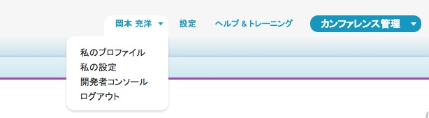

Apexは強く型付けされたオブジェクト指向のプログラミング言語であり、Saleforceインスタンスでコードを実行するために使用されます。Apexの構文はJavaに似ており、データベース処理をあらかじめサポートしています。このモジュールでは、カンファレンスのスピーカーに確認メールを送信するロジックを含んだEmailManagerクラスを作成します。

## ステップ 1: EmailManagerクラスを作成する

1. Salesforce画面の右上で自分の名前をクリックし、ドロップダウンメニューで **開発者コンソール** をクリックします。

    

1. 開発者コンソールで、**File** > **New** > **Apex Class** の順にクリックします。クラス名に **EmailManager** と入力し、 **OK** をクリックします。

2. 次のようにクラスを実装します:

    ```
    public class EmailManager {

        public void sendMail(String address, String subject, String body) {
            Messaging.SingleEmailMessage mail = new Messaging.SingleEmailMessage();
            String[] toAddresses = new String[] {address};
            mail.setToAddresses(toAddresses);
            mail.setSubject(subject);
            mail.setPlainTextBody(body);
            Messaging.sendEmail(new Messaging.SingleEmailMessage[] { mail });
        }

    }
    ```

1. **File** > **Save** の順にクリックしてファイルを保存します。

## ステップ 2: メールを送信する

次に、開発者コンソールからメールを送信し、EmailManagerクラスをテストします。なお、このワークショップの後半では、このEmailManagerクラスをアプリケーションと連携させて確認メールの送信プロセスを自動化します。

1. 開発者コンソールで、**Debug** > **Open Execute Anonymous Window** の順にクリックします。

2. 次のApexコードを入力します（「YOUR_EMAIL_ADDRESS」には、自分のメールアドレスを入力）。:

    ```
    String address = 'YOUR_EMAIL_ADDRESS';
    String subject = '講演者確認';
    String body = 'カンファレンスでのご公演ありがとうございます。';
    EmailManager em = new EmailManager();
    em.sendMail(address, subject, body);
    ```

3. **Execute** ボタンをクリックします

4. 確認メールが届いていることを確認します


## ステップ 3: 静的メソッドを使用する

EmailManagerはインスタンス固有の変数を使わないユーティリティクラスであるため、sendMail()を静的メソッドにすることができます

1. 開発者コンソールで、EmailManagerクラスを開きます

1. sendMail()を静的メソッドに変更するには、次のように署名を変更します（staticというキーワードを追加）:

    ```
    public static void sendMail(String address, String subject, String body) {
    ```

1. ファイルを保存します

1. **Execute Anonymous Window** に戻ります（ **Debug** > **Open Execute Anonymous Window** の順にクリック）。

1. Apexコードを次のように書き換え、静的メソッドの呼び出しでsendMail()が呼び出されるようにします:

    ```
    String address = 'YOUR_EMAIL_ADDRESS';
    String subject = '講演者確認';
    String body = 'カンファレンスでのご公演ありがとうございます。';
    EmailManager.sendMail(address, subject, body);
    ```

1. **Execute** をクリックしてメールを確認します。


<div class="row" style="margin-top:40px;">
<div class="col-sm-12">
<a href="Creating-the-Application.html" class="btn btn-default"><i class="glyphicon glyphicon-chevron-left"></i> 戻る</a>
<a href="Accessing-Data-using-SOQL-and-DML.html" class="btn btn-default pull-right">次へ <i class="glyphicon glyphicon-chevron-right"></i></a>
</div>
</div>
