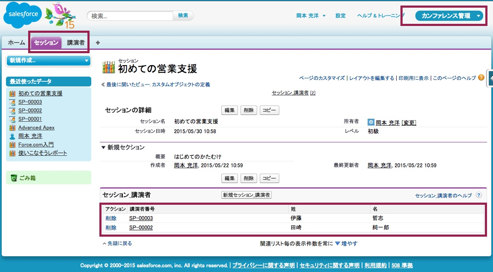
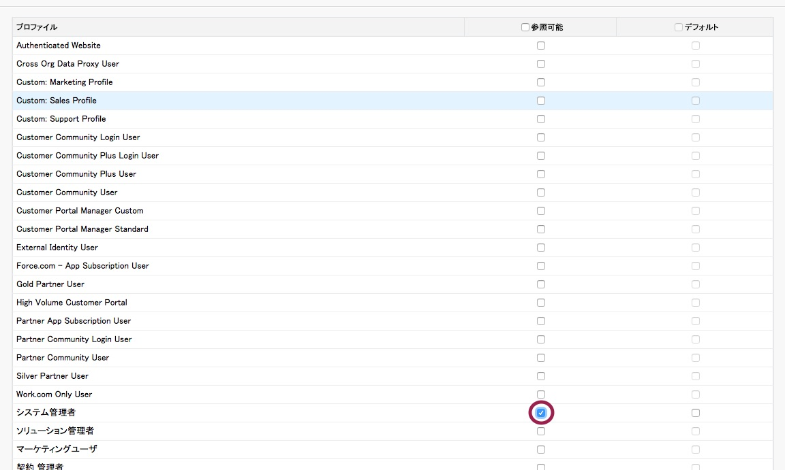
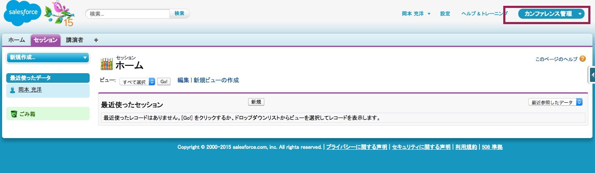
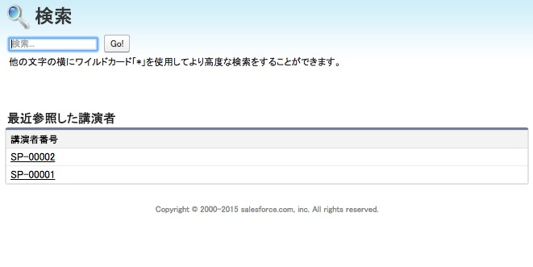
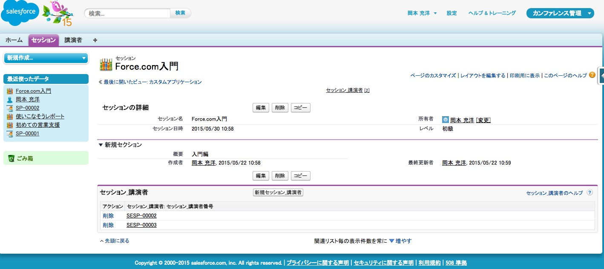
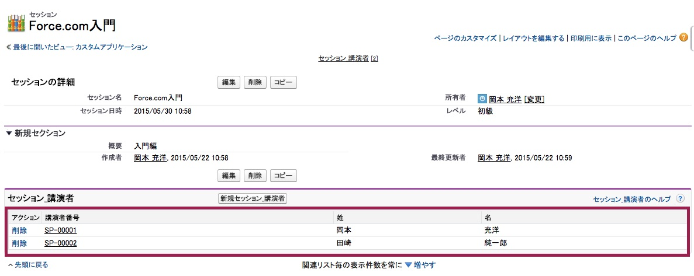
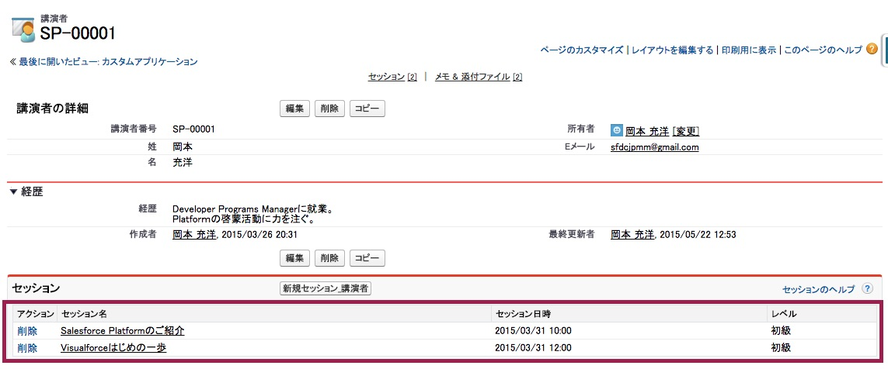
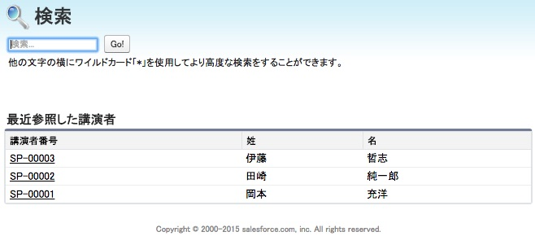

このモジュールでは、セッション及び講演者オブジェクトへアクセスするためのタブを作成します。さらにこれらのタブをアプリケーションとしてグループ化することによってアクセスしやすくします。最後にページレイアウトを調整し、講演者とセッションの関連が見えるようにします。

## ステップ 1: タブの作成

セッションタブの作成を行います:

1. **設定** 画面より、**ビルド** > **作成** > **タブ** を選択します

1. **カスタムオブジェクトタブ** セクションの **新規** をクリックします。

1. オブジェクトに **セッション** を選択し、 タブスタイルの虫眼鏡アイコンより **本** アイコンを選択します。

1. **次へ**, **次へ** とクリックします。

1. **タブを含める** チェックボックスのチェックを外して、セッションタブが既存のどのアプリケーションにも表示されないことを確認し、**保存** をクリックします。(ステップ 2 で、セッションタブを新しいアプリケーションへ追加します)

講演者タブの作成を行います:

1. **設定** 画面より、**ビルド** > **作成** > **タブ** を選択します

1. オブジェクトに **講演者** を選択し、 タブスタイルの虫眼鏡アイコンより **本** アイコンを選択します。

1. **次へ**, **次へ** とクリックします。

1. **タブを含める** チェックボックスのチェックを外して、セッションタブが既存のどのアプリケーションにも表示されないことを確認し、**保存** をクリックします。

## ステップ 2: アプリケーションの作成

Salesforceのアプリケーションとはユーザが関連する機能に素早くアクセスできるようにするためにまとめられたタブのグループを指します。

1. **設定** 画面より、 **ビルド** > **作成** > **アプリケーション** を選択します。

1. **アプリケーション** セクションで **新規** をクリックします。

1. **カスタムアプリケーション** を選択し、 **次へ** をクリックします。

1. **カンファレンス管理** をアプリケーションの表示ラベルへ、 **Conference** をアプリケーション名に入力し、 **次へ** をクリックします。

1. デフォルトのアプリケーションロゴのまま **次へ** をクリックします。

1. **セッション** 及び **講演者** タブを **選択されたタブ** へ移動し、 **次へ** をクリックします。

1. **システム管理者** の **参照可能** チェックボックスにチェックを付け **保存** をクリックします。

    

1. **カンファレンス管理** をアプリケーションセレクタより選択します (画面右上隅)

    

    > もしカンファレンス管理アプリケーショｎがアプリケーションセレクタに表示されない場合、おそらく設定画面でシステム管理者プロファイルへの権限付与を忘れています。設定画面より ビルド > 作成 > アプリケーション よりカンファレンス管理の横の編集をクリックして、システム管理者プロファイルの参照可能チェックを付け、保存をクリックします。

## ステップ 3: サンプルデータの入力

1. **講演者**　タブをクリックし、**新規** より、いくつかのサンプルの講演者を入力します。

1. **セッション** タブをクリックし、 **新規** ボタンより、幾つかサンプルのセッションを入力します。

1. 講演者をセッションへアサインします:
  - セッションの詳細画面より、**新規セッション_講演者** をクリックします。
  - 講演者の虫眼鏡アイコンより、講演者をポップアップダイアログより選択し、 **保存** をクリックします。

    

    

    > ここで注意点として現時点での講演者リストや講演者ルックアップダイアログは、有益な情報を提供しない点に注意して下さい。これは次のステップにて修正します。

## ステップ 4: セッションページレイアウトを最適化する

このステップでは、セッションの詳細画面を最適化します: ユーザがセッションの講演者を容易に特定できるように 適切な項目を講演者リストに追加します。  

1. **設定** 画面より、 **ビルド** > **作成** > **オブジェクト** を選択します。

1. **セッション** のリンクをクリックします。

1. **ページレイアウト** セクションで、セッションレイアウトの横の **編集** をクリックします

1. **関連リスト** セクションで、レンチのアイコンをクリックします(関連リストのプロパティ)

1. 以下の項目を**選択済みの項目**へ追加します:
   - 講演者: 講演者番号
   - 講演者: 姓
   - 講演者: 名

1. 以下の項目を**選択済みの項目**から削除します:
  - セッション_講演者: セッション_講演者番号

1. **OK**　をクリックします。

1. **保存** をクリックします(左上端)

## ステップ 5: 講演者ページレイアウトの最適化

このステップでは、セッションの詳細画面を最適化します: ユーザが講演者のセッションを容易に特定できるように 適切な項目をセッションリストに追加します。

1. **設定** 画面より、 **ビルド** > **作成** > **オブジェクト** を選択します。

1. **講演者** のリンクをクリックします。

1. **ページレイアウト** セクションで、講演者レイアウトの横の **編集** をクリックします

1. **関連リスト** セクションで、レンチのアイコンをクリックします(関連リストのプロパティ)

1. 以下の項目を**選択済みの項目**へ追加します:
  - セッション: セッショｎ名
  - セッション: セッション日時

1. 以下の項目を**選択済みの項目**から削除します:
  - セッション_講演者: セッション_講演者番号

1. **OK**　をクリックします。

1. **保存** をクリックします(左上端)

## ステップ 6: 講演者ルックアップを最適化する

このステップでは, 講演者を特定しやすくするために講演者ルックアップダイアログを最適化します。

1. **設定** 画面より、 **ビルド** > **作成** > **オブジェクト** を選択します。

1. **講演者** のリンクをクリックします。

1. スクロールし **検索レイアウト** のセクションで、**ルックアップダイアログ** の横の **編集** をクリックします。

1. **姓** と **名** を **選択済みの項目** へ追加します

1. **保存** をクリックします。

## ステップ 7: アプリケーションをテストする

1. セッショｎタブをクリックし、セッションを選択し、講演者リストにスピーカー番号、姓、名が表示されている事を確認します。

1. 新しい講演者をセッションへ関連付けるのに、講演者ルックアップダイアログに講演者の姓及び名が表示されている事を確認します。

1. 講演者タブをクリックし、講演者を選択し、セッションリストにセッション名及び日時が表示されている事を確認します。

> もしリストが想定されている項目を表示しない場合、ページレイアウト画面で保存ボタンを押し忘れている可能性があります。ステップ 4 及び 5に戻り、保存ボタンを最後に押して下さい。

<a href="Creating-the-Data-Model.html" class="btn btn-default"><i class="glyphicon glyphicon-chevron-left"></i> 戻る</a>
<a href="Creating-an-Apex-Class.html" class="btn btn-default pull-right">次へ <i class="glyphicon glyphicon-chevron-right"></i></a>

