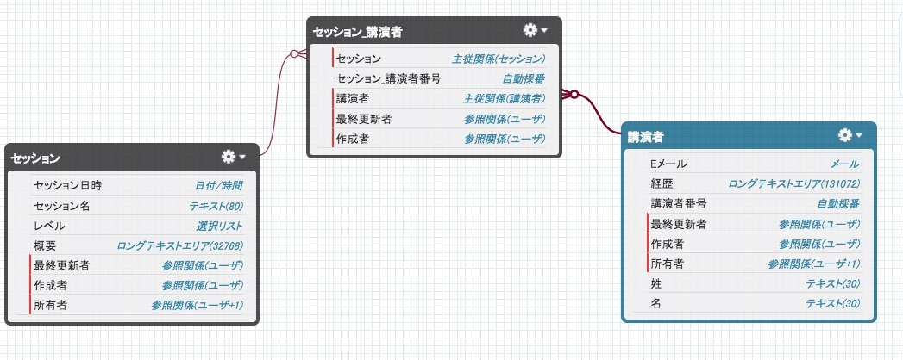
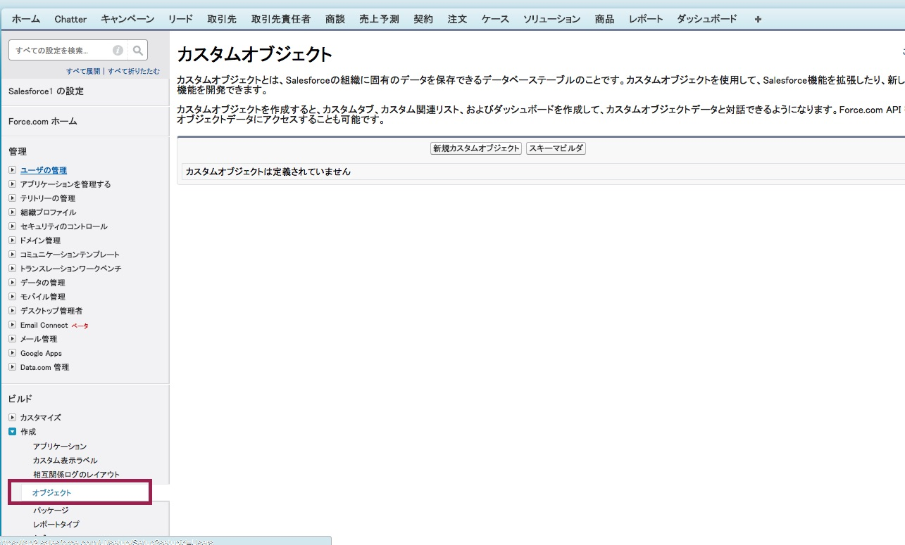
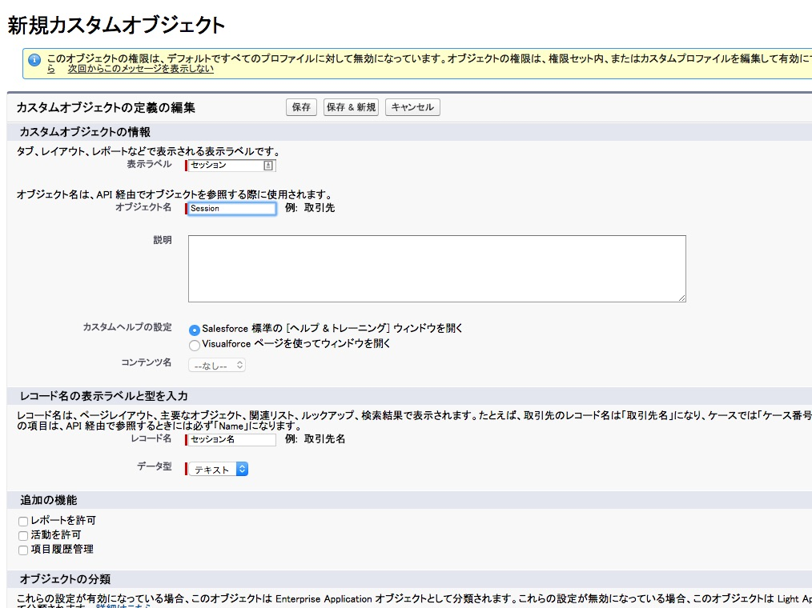
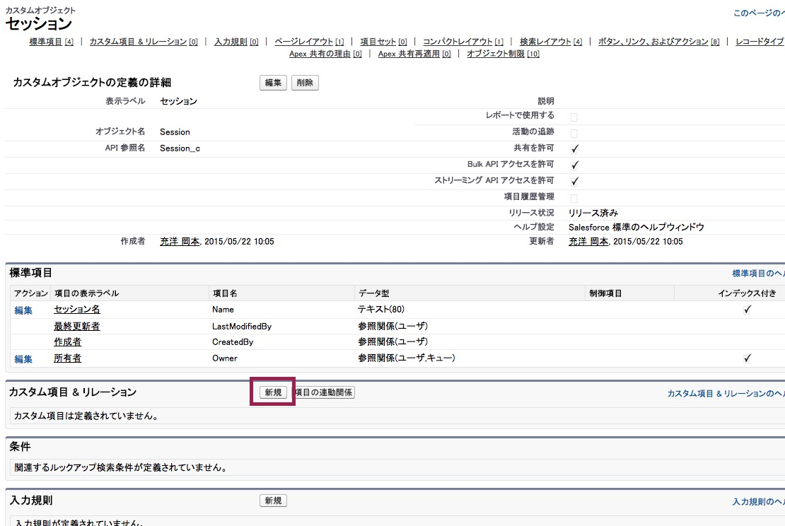
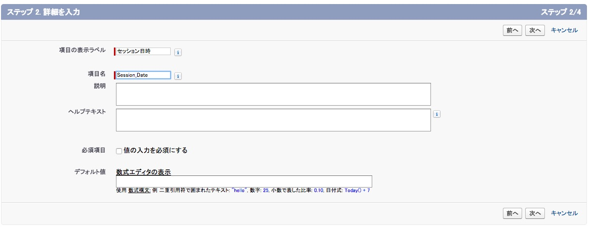
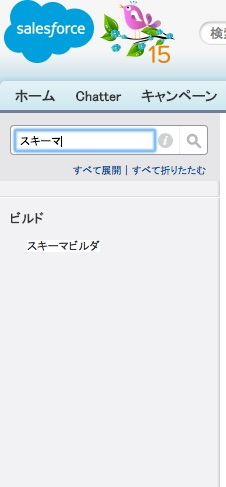

このモジュールでは,カンファレンスアプリケーションを作成するために、カスタムオブジェクトを作成します。

## ステップ 1: カンファレンスセッションオブジェクトの作成

1. Developer Editionアカウントにログインします

1. **設定** リンクをクリックします (右上端)

    

1. 左ナビゲーションメニューより **ビルド** > **作成** > **オブジェクト** をクリックします

    

1. **新規カスタムオブジェクト** をクリックし、以下のように **セッション** オブジェクトを作成します。(下記に明記されずにデフォルトで入力される値はそのまま利用します):
  - 表示ラベル: **セッション**
  - オブジェクト名: **Session**
  - レコード名: **セッション名**
  - データ型: **テキスト**

    

1. **保存**をクリックします。

1. **カスタム項目 & リレーション** セクションで、**新規**をクリックします。

    

1. **セッション日時** 項目を以下の様に作成します:
  - データ型: **日付/時間**
  - 項目の表示ラベル: **セッション日時**
  - 項目名: **Session_Date**

    

    **次へ**, **次へ**, **保存 & 新規** とクリックします。

1. **概要** 項目を以下の様に作成します:
  - データ型: **ロングテキストエリア**
  - 項目の表示ラベル: **概要**
  - 項目名: **Description**

    **次へ**, **次へ**, **保存 & 新規** とクリックします。

1. **レベル** 項目を作成します:
  - データ型: **選択リスト**
  - 項目の表示ラベル: **レベル**
  - 値: **初級**, **中級**, **上級** (それぞれの値を一行に記述して下さい)
  - 項目名: **Level**

     **次へ**, **次へ**, **保存** とクリックします。

## ステップ 2: 講演者オブジェクトの作成

1. 設定画面より **ビルド** > **作成** > **オブジェクト** をクリックします

1. **新規カスタムオブジェクト**をクリックし、以下の様に **講演者** オブジェクトを作成します(下記に明記されずにデフォルトで入力される値はそのまま利用します):
  - 表示ラベル: **講演者**
  - オブジェクト名: **Speaker**
  - レコード名: **講演者番号**
  - データ型: **自動採番**
  - 表示形式: **SP-{00000}**
  - 開始番号: **1**

1. **保存** をクリックします。

1. **姓** 項目を以下の様に作成します:
  - データ型: **テキスト**
  - 項目の表示ラベル: **Last Name**
  - 文字数: **30**
  - 項目名: **Last_Name**

    **次へ**, **次へ**, **保存 & 新規** とクリックします。

1. **カスタム項目 & リレーション** セクションで、**新規**をクリックし、 **名** 項目を以下の様に作成します:
  - データ型: **テキスト**
  - 項目の表示ラベル: **名**
  - 文字数: **30**
  - 項目名: **First_Name**

    **次へ**, **次へ**, **保存 & 新規** とクリックします。

1. **Eメール** 項目を以下の様に作成します:
  - データ型: **メール**
  - 項目の表示ラベル: **Eメール**
  - 項目名: **Email**

    **次へ**, **次へ**, **保存 & 新規** とクリックします。

1. **経歴** 項目を以下の様に作成します:
  - データ型: **ロングテキストエリア**
  - 項目の表示ラベル: **経歴**
  - 項目名: **Bio**

    **次へ**, **次へ**, **保存** とクリックします。

## ステップ 3: セッション_講演者 接続用のオブジェクトの作成

セッション_講演者 オブジェクトは セッションと講演者を多対多のリレーションシップを持たせるためのオブジェクトです : セッションは一人以上の講演者を持つことができ、一方講演者も１つもしくは複数のセッションを受け持つことができます。これは従来のリレーショナルデータベースでの手法と似ています。

1. 設定画面より **ビルド** > **作成** > **オブジェクト** をクリックします

1. **新規カスタムオブジェクト**をクリックし、以下の様に **セッション_講演者** オブジェクトを作成します(下記に明記されずにデフォルトで入力される値はそのまま利用します)::
  - 表示ラベル: **セッション_講演者**
  - オブジェクト名: **Session_Speaker**
  - レコード名: **セッション_講演者番号**
  - データ型: **自動採番**
  - 表示形式: **SESP-{00000}**
  - 開始番号: **1**

1. **保存**をクリックします

1. **カスタム項目 & リレーション** セクションで、**新規**をクリックし、 **セッション** 項目を以下の様に作成します:
  - データ型: **主従関係**
  - 関連先: **セッション**
  - 項目の表示ラベル: **セッション**
  - 項目名: **Session**
  - 子リレーション名: **Speakers**

    **次へ**, **次へ**, **次へ**とクリックし、関連リストの表示ラベルに "**講演者**" を設定し **保存 & 新規** をクリックします

1.  **講演者** 項目を以下の様に作成します:
  - データ型: **主従関係**
  - 関連先: **講演者**
  - 項目の表示ラベル: **講演者**
  - 項目名: **Speaker**
  - 子リレーション名: **Sessions**

    **次へ**, **次へ**, **次へ**とクリックし、関連リストの表示ラベルに "**セッション**" を設定し **保存** をクリックします

## ステップ 4: データモデルをスキーマビルダで確認する

1. 設定画面より"**スキーマ**" を左ナビゲーションより検索し、 **スキーマビルダー** をクリックします。

    

1. **選択解除** をクリックします

1. **セッション**, **講演者**, 及び**セッション_講演者** をチェックします。

1. このカンファレンスアプリケーションのデータモデルを確認します。必要に応じて変更することも可能です。

<a href="Creating-a-Developer-Edition-Account.html" class="btn btn-default"><i class="glyphicon glyphicon-chevron-left"></i> 戻る</a>
<a href="Creating-the-Application.html" class="btn btn-default pull-right">次へ <i class="glyphicon glyphicon-chevron-right"></i></a>

