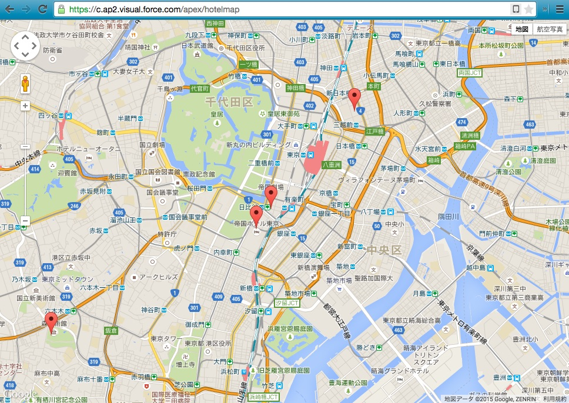
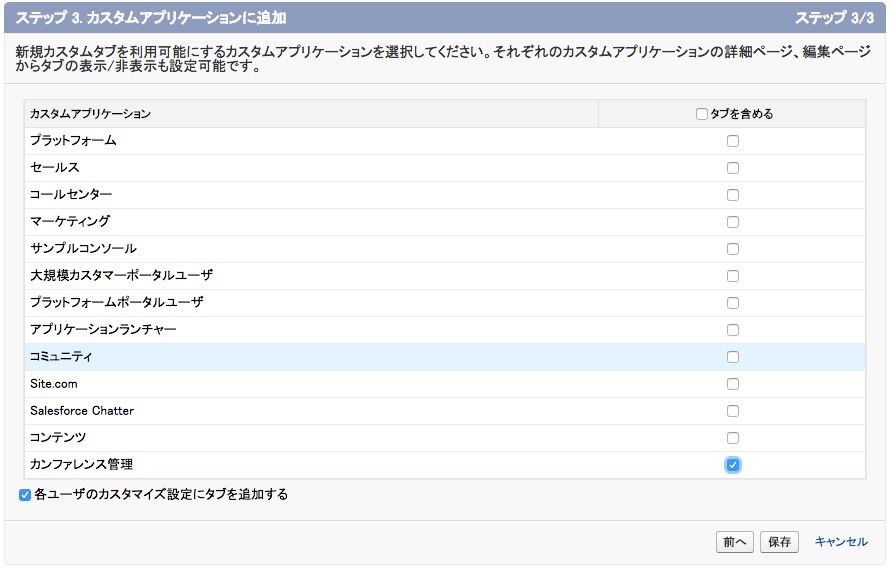

このモジュールでは、カンファレンスのホテルのリストを返すメソッドを含んだカスタムコントローラを作成します。続いて、JavaScript Remotingでそのメソッドを呼び出すVisualforceページを作成し、Google Maps SDKを使ってマップにホテルを表示させます。



## ステップ 1: オブジェクト**ホテル** を作成する

1. **設定** で、 **ビルド** > **作成** > **オブジェクト** の順に選択します

2. **新規カスタムオブジェクト** をクリックし、次のように定義します:
  - 表示ラベル： **Hotel**
  - オブジェクト名： **ホテル**
  - レコード名: **ホテル名**
  - データ型： **テキスト**

3. **保存** をクリックします

4. **カスタム項目＆リレーション** セクションで **新規** をクリックし、次のようにして **位置情報** という項目を作成します:
    - データ型： **地理位置情報**
    - 項目の表示ラベル: **位置情報**
    - 緯度および経度表示の表記法： **小数**
    - 小数点の位置: **7**
    - 項目名: **Location**

    **次へ** 、 **次へ** 、 **保存** の順にクリックします。

5. ホテルオブジェクトのタブを作成します
  - **設定** で、 **ビルド** > **作成** > **タブ** の順にクリックします
  - **カスタムオブジェクトタブ** セクションで、 **新規** をクリックします
  - **Hotel** オブジェクトを選択して、タブスタイルのアイコンとして **ビル** を選択し、 **次へ** 、 **次へ** の順にクリックします。
  - **タブを含める** チェックボックスをオフにしてから、 **カンファレンス管理** チェックボックスをオンにし、**保存** をクリックします

    

6. **Hotel** タブに移動し、ホテルのレコードを何件か入力します。その際、次のように、緯度（Latitude）と
経度（Longitude）の情報も指定します:
  - マリオットホテル(37.785143 -122.403405)
  - ヒルトンユニオンスクエア (37.786164 -122.410137)
  - ハイアット (37.794157 -122.396311)

    

## ステップ 2: コントローラ HotelRemoter を作成する

1. 開発者コンソール（Salesforce画面の右上で自分の名前をクリックし、ドロップダウンメニューから選択）で、**File** > **New** > **Apex Class** の順に選択します。クラス名に　**HotelRemoter**　と入力し、　**OK**　をクリックします。

1. 次のようにクラスを実装します:

    ```
    global with sharing class HotelRemoter {

        @RemoteAction
        global static List<Hotel__c> findAll() {
            return [SELECT Id, Name, Location__Latitude__s, Location__Longitude__s
                        FROM Hotel__c];
        }

    }
    ```

1. ファイルを保存します

## ステップ 3: Googleマップを組み込んだVisualforceページを作成する

1. 開発者コンソールで、 **File** > **New** > **Visualforce Page** の順に選択し、ページ名に **HotelMap** と入力し、 **OK** をクリックします

1. 次のようにHotelMapを実装します:

    ```
    <apex:page sidebar="false" showheader="false">

    <head>
    <style type="text/css">
      html { height: 100% }
      body { height: 100%; margin: 0; padding: 0 }
      #map-canvas { height: 100% }
    </style>
    <script src="https://maps.googleapis.com/maps/api/js?sensor=false"></script>
    <script>
    var map;

    function initialize() {
        var mapOptions = {
            center: new google.maps.LatLng(37.784173, -122.401557),
            zoom: 15
        };
        map = new google.maps.Map(document.getElementById("map-canvas"), mapOptions);
    }

    google.maps.event.addDomListener(window, 'load', initialize);

    </script>
    </head>
    <body>
      <div id="map-canvas"/>
    </body>

    </apex:page>
    ```

1. ファイルを保存します

1. **Preview** ボタン（画面の左上）をクリックし、ブラウザでHotelMapページをテストします

## ステップ 4: マップ上にホテルを表示する

1. 次のようにコードを更新し、HotelRemoterを、Visualforceページ **HotelMap** のコントローラとして割り当てます:

    ```
    <apex:page sidebar="false" showheader="false" controller="HotelRemoter">
    ```

1. loadHotels()関数を次のように定義します（initilize()関数の直後）:

    ```
    function loadHotels() {
        Visualforce.remoting.Manager.invokeAction('{!$RemoteAction.HotelRemoter.findAll}',
            function(result, event){
                if (event.status) {
                    for (var i=0; i<result.length; i++) {
                        var id = result[i].Id;
                        var name = result[i].Name;
                        var lat = result[i].Location__Latitude__s;
                        var lng = result[i].Location__Longitude__s;
                        addMarker(id, name, lat, lng);
                    }
                } else {
                    alert(event.message);
                }
            },
            {escape: true}
        );
    }
    ```

1. addMarker()関数を次のように定義します（loadHotels()関数の直後）:

    ```
    function addMarker(id, name, lat, lng) {
        var marker = new google.maps.Marker({
      			position: new google.maps.LatLng(lat, lng),
      			map: map,
      			title: name
        });
        google.maps.event.addListener(marker, 'click', function(event) {
            window.top.location = '/' + id;
        });
  	}
    ```

1. 4.	loadHotels()を **initialize()** 関数の最後の行で呼び出します:

    ```
    loadHotels();
    ```

1. ファイルを保存します

1. **Preview** ボタン（画面の左上）をクリックし、ブラウザでHotelMapページをテストします。ステップ1で入力した
ホテルの場所にマーカーが表示されることを確認します。


<div class="row" style="margin-top:40px;">
<div class="col-sm-12">
<a href="Creating-a-Controller-Extension.html" class="btn btn-default"><i class="glyphicon glyphicon-chevron-left"></i> 戻る</a>
<a href="Using-the-Salesforce1-Platform-APIs.html" class="btn btn-default pull-right">次へ <i class="glyphicon glyphicon-chevron-right"></i></a>
</div>
</div>
