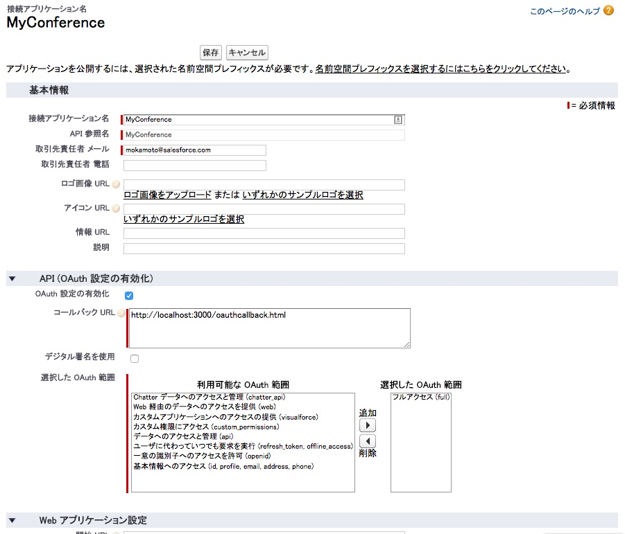
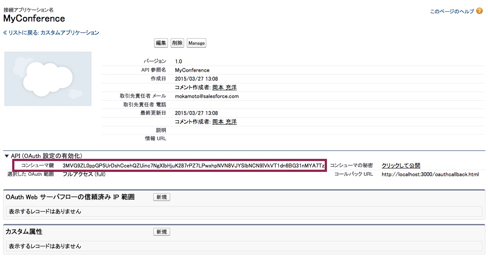

このモジュールでは、Salesforceインスタンスの外部で実行されるアプリケーションを作成します。Salesforceでの認証にはOAuthを使い、REST APIによってSalesforceデータにアクセスするようにします。


## 要件

このモジュールの演習を行うには、Node.jsが必要です。Node.jsがお使いのシステムにインストールされていない場合、[こちら](http://nodejs.org/)からインストールできます。

> This module is recommended but optional. If you are not interested in building custom applications (applications hosted outside your Salesforce instance), you can move to Module 11.

## ステップ 1: 接続アプリケーションを作成する

1. **設定** で、 **ビルド** > **作成** > **アプリケーション** の順にクリックします

1. **接続アプリケーション** セクションで **新規** をクリックして、次のように新しい接続アプリケーションを定義します:
  - 接続アプリケーション名: MyConference
  - API参照名: MyConference
  - 取引先責任者 メール: 自身のメールアドレスを入力します
  - OAuth設定の有効化: チェックする
  - コールバックURL: http://localhost:3000/oauthcallback.html
  - 選択したOAuth範囲: フルアクセス (full)

    

1. **保存** をクリックします


## ステップ 2: 関連ファイルをインストールする

1. 1.	[このファイル](https://github.com/ccoenraets/salesforce-developer-workshop/archive/master.zip)をダウンロードして解凍するか、[このリポジトリ](https://github.com/ccoenraets/salesforce-developer-workshop)からコピーを取得します。

1. 2.	コードエディタ（各自、使い慣れたものを使用してください）で、 **client/index.html** 内のコードを確認します:
    - It provides the basic markup to render a list of sessions as shown in the screenshot above.
    - 	ratchet.cssが使われています。[Ratchet](http://goratchet.com/)は、モバイルアプリケーション用のスタイルを提供するシンプルなCSSツールキットです。
    - It uses [ForceTK](https://github.com/developerforce/Force.com-JavaScript-REST-Toolkit), the Force.com JavaScript REST Toolkit, to integrate with Salesforce.
    - You will code the logic of the application (OAuth login) and data access logic in js/app.js which is empty at this time.  

1. 4.	コードエディタで、 **client/oauthcallback.html** 内のコードを確認します:

    At the end of the OAuth workflow, the Salesforce authentication process loads the redirect URI you specified in your Connected App and passes the access token and other OAuth values (server instance, refresh token, etc.) in the query string. Your redirect URI page simply needs to parse the query string, extract the access token and the other OAuth values, and pass that information back to your application by invoking the oauthCallback() function you will code in Step 4.

1. Using your favorite code editor, examine the code in **server.js**. server.js implements a small HTTP server that provides two features:
    - Web server for static content. The document root for the web server is the client directory.
    - Proxy for Salesforce REST requests. Because of the browser’s cross-origin restrictions, your JavaScript application hosted on your own server (or localhost) will not be able to make API calls directly to the *.salesforce.com domain. The solution is to proxy your API calls through your own server.

## Step 3: Start the Node.js server


1. Open Terminal (Mac) or a Command prompt (Windows)

1. Navigate (cd) to the **salesforce-developer-workshop** (or salesforce-developer-workshop-master) directory

1. Install the Node.js server dependencies:

    ```
    npm install
    ```

1. Start the server:  

    ```
    node server
    ```

1. Test the application. Open a browser and access the following URL:

    ```
    http://localhost:3000
    ```

    Since we didn't authenticate with Salesforce yet, all you should see at this point is an empty list of sessions.

## ステップ 4: OAuthを使ったSalesforce認証を実装する

1. Using your favorite code editor, open **app.js** in **salesforce-developer-workshop/client/js**

1. Declare the following variables:

    ```
    var apiVersion = 'v30.0',
    clientId = 'YOUR_CONSUMER_KEY',
    loginUrl = 'https://login.salesforce.com/',
    redirectURI = 'http://localhost:3000/oauthcallback.html',
    proxyURL = 'http://localhost:3000/proxy/',
    client = new forcetk.Client(clientId, loginUrl, proxyURL);
    ```

1. In **Setup** (back in Salesforce), click **Build** > **Create** > **Apps**. In the **Connected Apps** section, click **MyConference**, and copy the **Consumer Key** to your clipboard.

    

1. In app.js, replace YOUR&#95;CONSUMER_KEY with the consumer key you copied to your clipboard

1. In app.js, declare a function named **login()** implemented as follows (right after the variable declarations):

    ```
    function login() {
        var url = loginUrl + 'services/oauth2/authorize?display=popup&response_type=token'
                    + '&client_id=' + encodeURIComponent(clientId)
                    + '&redirect_uri=' + encodeURIComponent(redirectURI);
        window.open(url);
    }
    ```

1. Declare a function named **oauthCallback()** implemented as follows (right after the login() function):

    ```
    function oauthCallback(response) {
        if (response && response.access_token) {
            client.setSessionToken(response.access_token,
                                   apiVersion,
                                   response.instance_url);
            console.log('OAuth authentication succeeded');
        } else {
            alert("AuthenticationError: No Token");
        }
    }
    ```

    > oauthCallback() is called by the oauthcallback.html page at the end of the OAuth workflow (see oauthcallback.html in step 2 for details).

1. Invoke the login() function as the last line of the app.js file:

    ```
    login();
    ```

1. Test the application
  - Open a browser and access [http://localhost:3000](http://localhost:3000)
  - Login with your Developer Edition credentials
  - Open the browser console: you should see the **OAuth authentication succeeded** message

  > It may take a few minutes for a Connected App to be available after you create it. If you get this message: **error=invalid_client_id&error_description=client%20identifier%20invalid**, wait a few minutes and try again.

## ステップ 5: REST APIを使用する

1. In app.js, declare a function named **getSessions()** implemented as follows (right after the oauthCallback() function):

    ```
    function getSessions() {
        var soql = "SELECT Id, Name, Session_Date__c FROM Session__c",
            html = '';
        client.query(soql,
            function (data) {
                var sessions = data.records;
                for (var i=0; i<sessions.length; i++) {
                    html += '<li class="table-view-cell">' + sessions[i].Name + '</li>';
                }
                $('.session-list').html(html);
            },
            function (error) {
                alert("Error: " + JSON.stringify(error));
            });
        return false;
    }
    ```

1. Modify the oauthCallback() function to invoke getSessions() when the user has been successfully authenticated.

    ```
    console.log('OAuth authentication succeeded');
    getSessions();
    ```

1. Test the application
  - Open a browser and access [http://localhost:3000](http://localhost:3000)
  - Login with your Developer Edition credentials
  - You should now see the list of sessions

> This is just the starting point for building a custom application written in JavaScript, authenticating with Salesforce using OAuth, and accessing Salesforce data using the REST APIs. If you are planning on building a real-life application based on this architecture, consider using a JavaScript framework such as [Backbone.js](http://backbonejs.org/) or [AngularJS](https://angularjs.org/) with [Ionic](http://ionicframework.com/).


<div class="row" style="margin-top:40px;">
<div class="col-sm-12">
<a href="Using-JavaScript-in-Visualforce-Pages.html" class="btn btn-default"><i class="glyphicon glyphicon-chevron-left"></i> 戻る</a>
<a href="Testing.html" class="btn btn-default pull-right">次へ <i class="glyphicon glyphicon-chevron-right"></i></a>
</div>
</div>
